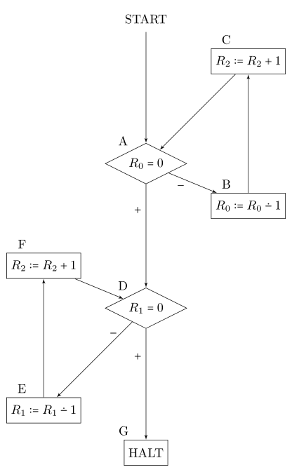

# registermaschine

This repository contains code in multiple programming languages for defining and running small register machines.

- Every implementation should provide some  means to describe the adder and the subtractor (see diagrams below), preferably in a succinct and readable way. See the Haskell example below.
- Every implementation should be able to run the adder. It is usually tested by running it on input `[1,5,7]` and obtaining `[0,0,13]`.
- Every implementation shoud be able to run the subtractor. It is usually tested by running it on input `[8,3]` and obtaining `[0,0,5]`.
- If you look closely at the subtractor, you may observe that it doesn't halt for every input. This is intentional. Every implementation should contain a global constant (or something similar, if the language lacks global constants) called `MAX_STEPS` (or similarly, if this name is discouraged by the naming conventions of the corresponding language). Defining it to be an integer *n* means that every machine will halt after at most *n* steps. Defining it to be some equivalent of `None`/`nil`/`Nothing`/etc. means you don't want to restrict the number of steps. In this case the program might run forever. This is tested with running the subtractor on input `[3,8]`. It should return something similar to `Bottom` if `MAX_STEPS = 100` or never finish if `MAX_STEPS = None`.

I consider implementations in the following languages to be complete (although not necessarily finished, as some don't look very idiomatic):

- Ceylon (due to [arseniiv](https://github.com/arseniiv))
- Clojure
- Common Lisp (thanks to Stanislav K. for reviewing the code and making it more portable)
- F#
- Haskell (thanks to arseniiv for reviewing)
- Nim
- Prolog (only tested with SICStus)
- Python (3.6 or later)

Adder:



```haskell
adder = Start a where
   a = Jeqz 0 d b
   b = Dec 0 c
   c = Inc 2 a
   d = Jeqz 1 g e
   e = Dec 1 f
   f = Inc 2 d
   g = Halt
```

Subtractor:


```haskell
subtractor = Start a where
   a = Jeqz 1 e b
   b = Jeqz 0 b c
   c = Dec 0 d
   d = Dec 1 a
   e = Jeqz 0 h f
   f = Dec 0 g
   g = Inc 2 e
   h = Halt
```

The source code of the diagrams can be found it `flussdiagramm.tex`.